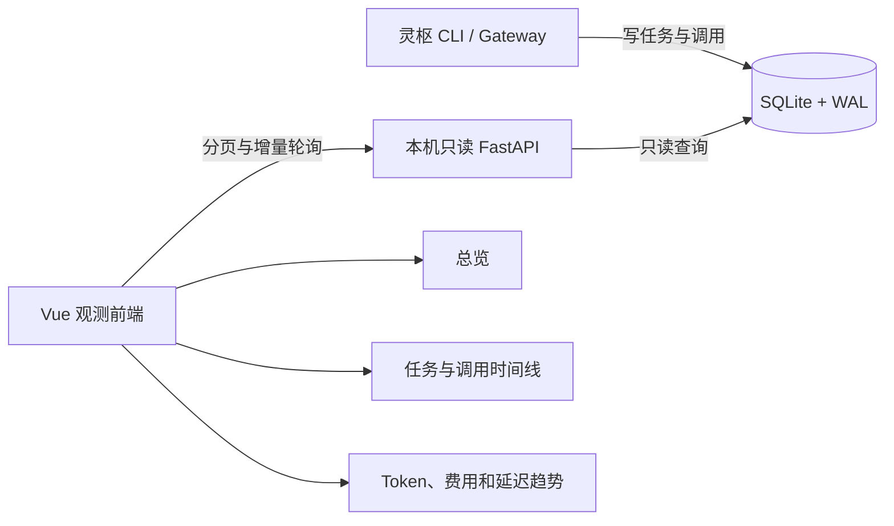

# 灵枢模型调用观测前端方案

> 文档状态：v0.3，图表化观测界面已实现
> 目标：让本机用户快速确认模型是否被调用、调用了谁、消耗了多少 Token，以及任务为什么成功或失败。

## 1. 结论

采用“本机查询 API + Vue 单页前端”的方案：

- 后端使用 FastAPI 提供只读 HTTP 接口，并通过 `lingshu dashboard` 仅监听 `127.0.0.1`；启动命令可在服务开始前执行受控的数据库迁移。
- 前端使用 Vue 3、TypeScript、Vite 和按需引入的 ECharts，构建产物由 Python 服务直接托管。
- MVP 使用前台 2 秒、后台 10 秒的增量轮询，不引入 WebSocket 或消息队列。
- SQLite 保持为唯一数据源，增加迁移版本、WAL、查询索引和更准确的调用状态字段。
- “任务是否成功”和“模型是否发生调用”使用两套独立口径，不能根据任务状态推断调用情况。
- 调用金额仍可在本地数据层留存，但当前个人观测界面不计算或展示费用。
- 左侧导航提供任务历史、三个 Provider 独立观测页和 Token 总用量五个入口。

静态 HTML 报告适合导出和归档，但无法可靠展示进行中的调用，因此不作为主界面。第一版不引入远程访问、多用户、权限系统、告警平台或 ORM。

## 2. 用户需要得到的答案

首页应在十秒内回答四个问题：

1. 当前有没有模型正在调用？
2. 最近一次调用由哪个 Provider 和模型处理？
3. 输入、缓存输入和输出 Token 分别是多少？
4. 调用成功、失败、超时，还是根本没有发出？

进一步钻取时，用户应能看到一次任务内的多轮模型调用、失败原因和最终任务结果。工具执行事件当前没有持久化，MVP 不承诺展示工具级时间线。

## 3. 已有能力与关键缺口

当前仓库已经具备：

- `tasks` 表：任务状态、提示词、Provider、模型别名、工作区、结果路径和错误。
- `calls` 表：实际模型、输入/缓存/输出 Token、延迟、估算费用、成功标记和错误。
- 成功调用及进入 `provider.chat` 后失败的调用都会记录在 `calls`。
- `doctor --live` 也会产生调用记录，但没有对应任务记录。
- CLI 可生成按 Provider 汇总的 Markdown 用量报告。

当前缺口包括：

- 没有 HTTP 查询接口和前端工程。
- 调用记录只在结束后写入，无法稳定表示“正在调用”。
- 失败调用的延迟会记录为 `0`，无法区分未测量与真实耗时。
- `request_id` 和 `finish_reason` 已在响应模型中存在，但没有持久化。
- 无法区分普通任务调用、`doctor` 探活调用和其他调用来源。
- 方舟套餐制的费用当前落为 `0`，会被误解为免费。
- 路由失败、缺少 Key 或预算拒绝可能发生在调用前；部分更早的失败甚至不会创建任务记录。
- SQLite 尚未启用 WAL，也缺少面向时间范围、任务和模型的查询索引。
- `usage_summary()` 只有 Provider 全量汇总，不能按时间、模型或任务钻取。

## 4. 核心数据口径

### 4.1 “是否发生调用”

前端应准确回答“本地是否尝试派发”和“是否收到供应商响应”，不能声称网络超时的请求一定已经被供应商收到或计费。以 `calls` 中预先创建的调用尝试记录为本地依据：

| 页面状态 | 判定条件 | 含义 |
|---|---|---|
| 未派发 | 任务已结束且关联调用数为 0 | 在 Provider 请求之前失败 |
| 派发尝试中 | 至少一条调用为 `ATTEMPTING` | 本地已进入发送流程，尚未确认收到响应 |
| 已确认响应 | 收到 HTTP 响应，且调用为 `SUCCEEDED` 或 `HTTP_ERROR` | Provider 已响应；任务之后仍可能失败 |
| 结果未知 | 调用为 `TIMED_OUT`、`NETWORK_ERROR` 或 `CANCELLED` | 本地尝试过发送，但无法证明 Provider 是否收到或计费 |
| 记录可能中断 | `ATTEMPTING` 超过请求超时与宽限期 | 进程可能异常退出，由查询层派生为 `STALE` |

任务状态与调用状态必须分开展示。例如：模型多轮 HTTP 调用可以全部成功，但任务仍可能因工具轮次超过上限而失败。

### 4.2 Token

- `input_tokens` 表示输入总量。
- `cached_input_tokens` 是输入 Token 的子集，不能再次与输入 Token 相加。
- 页面同时展示“输入”“其中缓存”“非缓存输入”“输出”。
- `non_cached_input_tokens = max(input_tokens - cached_input_tokens, 0)`。
- 聚合 Token 代表调用规模，不表示不同供应商之间完全等价的语义或计费价值。

### 4.3 费用

费用字段继续保留在本地调用记录中，供 CLI 报告和后续审计使用；当前前端不展示费用组件，也不根据费用影响调用或统计筛选。

### 4.4 成功率和延迟

- 调用成功率以已收到 HTTP 响应或明确失败的调用为分母，不包含 `ATTEMPTING` 和 `STALE`。
- 任务成功率以任务为分母，不与调用成功率混用。
- 延迟分位数只统计具有有效 `duration_ms` 的完成调用。
- 历史失败行的 `latency_ms=0` 显示为 `—`，不纳入 P50/P95。
- `doctor` 探活调用默认从任务成功率和业务用量中排除，可通过筛选单独查看。

## 5. 数据模型演进

### 5.1 `tasks`

新增或调整以下字段：

| 字段 | 类型 | 说明 |
|---|---|---|
| `risk` | TEXT | `low/normal/high` |
| `route_rule` | TEXT NULL | 命中的路由规则 |
| `failure_phase` | TEXT NULL | `CONFIG/ROUTING/PRE_DISPATCH/DISPATCH/POST_PROCESS` |
| `started_at` | TEXT | 任务开始时间 |
| `finished_at` | TEXT NULL | 任务结束时间 |
| `provider` | TEXT NULL | 路由完成前允许为空 |
| `model_alias` | TEXT NULL | 路由完成前允许为空 |

任务 ID 应在配置和数据库初始化成功后立即创建，再执行实时调用开关、工作区、路由和 Provider 就绪检查。配置无法加载或数据库无法初始化时没有可靠的持久化位置，只能作为 CLI 启动错误展示；这是明确的观测边界。其余派发前失败必须进入任务表。

### 5.2 `calls`

新增以下字段：

| 字段 | 类型 | 说明 |
|---|---|---|
| `state` | TEXT | `ATTEMPTING/SUCCEEDED/FAILED/HTTP_ERROR/INVALID_RESPONSE/TIMED_OUT/NETWORK_ERROR/CANCELLED` |
| `source` | TEXT | `TASK/DOCTOR`，后续可扩展 |
| `call_seq` | INTEGER | 同一任务内的调用序号 |
| `model_alias` | TEXT NULL | 调用时的逻辑模型别名 |
| `request_id` | TEXT NULL | 供应商请求 ID |
| `finish_reason` | TEXT NULL | 模型完成原因 |
| `error_type` | TEXT NULL | 稳定的错误分类，不依赖错误文案 |
| `started_at` | TEXT | 外部请求开始时间 |
| `finished_at` | TEXT NULL | 外部请求结束时间 |
| `duration_ms` | INTEGER NULL | 包含失败和超时在内的实测耗时 |
| `usage_reported` | INTEGER | 区分真实零 Token 与供应商未返回用量 |
| `pricing_mode` | TEXT | `METERED/SUBSCRIPTION/UNKNOWN` |
| `pricing_currency` | TEXT NULL | 调用时使用的原币种 |
| `input_price_per_million` | REAL NULL | 调用时的输入单价快照 |
| `cached_input_price_per_million` | REAL NULL | 调用时的缓存输入单价快照 |
| `output_price_per_million` | REAL NULL | 调用时的输出单价快照 |
| `usd_cny_rate` | REAL NULL | 本次估算使用的汇率 |
| `pricing_config_version` | TEXT NULL | 定价配置版本或内容摘要 |

调用流程改为“紧邻 HTTP 发送前插入 `ATTEMPTING`，再发出请求，最后原子更新结果和预算”。即使如此仍存在插入记录后、网络发送前进程崩溃的窗口，因此它只表示派发尝试。超过超时与宽限期的记录由查询层动态派生为 `STALE`，Dashboard 不写回调用状态。

`calls.task_id` 改为可空：普通任务应关联真实任务，`doctor` 探活使用 `task_id=NULL` 和 `source=DOCTOR`。迁移时把历史 `doctor-*` 合成 ID 保存到 `correlation_id` 后再置空。MVP 通过写入入口和查询口径保证二者分离，并增加唯一索引：

- `UNIQUE (task_id, call_seq)` 仅对非空任务 ID 生效。

MVP 暂不增加 `calls -> tasks` 外键与 `source/task_id` 检查约束，因为 Gateway
仍支持脱离 Orchestrator 的独立调用，强制外键会破坏该既有边界。若后续取消独立
调用能力，再通过新迁移收紧数据库约束。

Gateway 通过 `ModelRequest.source` 接收调用来源，由 Orchestrator 使用 `TASK`，由 `doctor` 使用 `DOCTOR`；该字段不会进入发送给供应商的请求负载。

### 5.3 SQLite 可靠性

- 新增 `schema_migrations` 表，迁移在事务中顺序执行。
- `lingshu dashboard` 启动时先在服务监听前执行迁移和备份；开始监听后，HTTP 路由全部只读。
- 迁移前创建数据库备份；旧字段保留兼容，无法回填的值使用 `NULL/UNKNOWN`。
- 启用 `PRAGMA journal_mode=WAL`、`PRAGMA busy_timeout=5000` 和 `PRAGMA foreign_keys=ON`。
- 新增索引：
  - `tasks(status, created_at)`
  - `calls(task_id, call_seq)`
  - `calls(provider, model, created_at)`
  - `calls(source, created_at)`
  - `calls(created_at, call_id)`
  - `tasks(created_at, task_id)`

## 6. 后端与前端架构



MVP 目录：

```text
src/lingshu/
├─ observability/
│  ├─ queries.py
│  └─ redaction.py
├─ dashboard/
│  ├─ app.py
│  └─ static/          # 前端构建产物
web/
├─ src/                 # Vue 页面、API、类型、格式化和样式
├─ tests/
├─ package.json
└─ vite.config.ts
```

Python 侧新增 `fastapi` 和 `uvicorn` 作为 `dashboard` 可选依赖；Node、Vite 和前端测试工具只在开发及构建阶段使用。生产构建输出复制到 `src/lingshu/dashboard/static/`，通过 Python 包数据配置纳入 wheel，最终用户运行 Dashboard 不需要安装 Node。图表和字体资源随包提供，不依赖公网 CDN。

CLI 增加：

```powershell
lingshu dashboard --host 127.0.0.1 --port 18765
```

第一版只允许 `127.0.0.1` 或 `localhost`；未来若需要 IPv6 或局域网访问，必须
另行验证 Host 解析，并设计鉴权和 TLS。

## 7. 查询 API

所有 HTTP 接口只支持读取，完整路径如下：

| 端点 | 用途 |
|---|---|
| `GET /api/v1/health` | 数据库和模式版本健康检查 |
| `GET /api/v1/overview` | 任务、调用、Token、已知费用和未计价调用摘要 |
| `GET /api/v1/tasks?status=&provider=&model=&dispatch=&search=&limit=` | 任务列表和筛选 |
| `GET /api/v1/tasks/{task_id}` | 任务详情及调用时间线 |
| `GET /api/v1/calls?source=&state=&provider=&model=&limit=` | 全局调用明细 |
| `GET /api/v1/providers` | Provider、模型、配置状态和计价模式；不返回 Key 或 Base URL |
| `GET /api/v1/analytics/daily` | 按 Provider、实际模型和北京时间日期范围聚合调用次数与 Token |

`/api/v1/usage/series` 和 `/api/v1/usage/breakdown` 随模型账本与趋势图进入增强阶段，不属于当前 MVP。

约束：

- 时间统一使用 UTC ISO 8601。调用列表按 `(created_at DESC, call_id DESC)`、任务列表按 `(created_at DESC, task_id DESC)` 稳定排序。
- MVP 列表使用有上限的 `limit`，服务端最大值为 200；游标分页随时间范围查询进入增强阶段。
- 默认只返回截断并脱敏的 prompt/error 预览。
- MVP 不提供任意文件读取接口，也不直接返回 `result_path` 的文件内容。
- 禁用 CORS，限制 Host，设置严格 CSP；API 和静态资源同源。
- 聚合 SQL 在后端统一实现，前端不自行解释 Token 或成功率口径。
- 错误响应统一为 `{"error":{"code":"STABLE_CODE","message":"中文说明"}}`，不回传堆栈或内部路径。

## 8. 界面方案

### 8.1 信息架构

目标信息架构包含五个左侧导航入口：

1. **任务历史**：任务列表以及创建、路由、模型调用和结束的时间线。
2. **方舟 Coding Plan**：方舟通道的调用次数与 Token 趋势。
3. **阿里云百炼**：百炼通道的调用次数与 Token 趋势。
4. **DeepSeek 官方**：DeepSeek 通道的调用次数与 Token 趋势。
5. **Token 总用量**：跨 Provider 查看 Token 趋势与实际模型排行。

三个 Provider 页面使用同一结构：默认最近 30 天，可切换最近 7/30/90 天或自定义日期；第二个筛选条件使用调用时记录的实际模型 ID。全部日期按 `Asia/Shanghai` 聚合并补齐没有调用的日期。

### 8.2 任务历史

顶部状态条明确显示：

- `当前无派发尝试`
- `2 个任务正在尝试派发 3 个模型`
- `1 个请求结果未知，供应商可能已收到`
- `记录可能中断，需要检查`

核心卡片：

- 任务：总数、成功、失败、进行中。
- 调用：派发尝试、确认响应、明确失败、结果未知。
- Token：输入、其中缓存、输出、缓存占比。
- 延迟：平均值和有效样本数；P50/P95 在增强阶段加入。
- 未派发失败：任务失败但调用数为零。

任务历史保留总览摘要，但把主要空间交给筛选表与任务详情；任务状态和调用事实始终并排展示。

### 8.3 任务详情

以纵向时间线展示：

1. 任务创建。
2. 路由到 Provider/模型，或在派发前失败。
3. 每轮模型调用：派发状态、模型、耗时、Token、缓存命中和错误分类。
4. 任务最终状态。

工具调用和后处理当前没有独立事件数据，MVP 不伪造该时间线。增强阶段如确有排障需求，再增加 `task_events` 或 `tool_runs` 表，记录阶段、序号、工具名、时间、结果状态和脱敏错误。

标题区必须同时出现两个徽标，例如：`任务失败` + `7 次派发尝试，其中 7 次确认响应`，避免用户误判。

### 8.4 视觉方向

采用 Linear 风格的蓝白绿观测台：大面积冷白与浅蓝灰构成空间层次，深蓝用于结构和数字，青绿色只强调连通、成功与活动脉冲，异常状态使用克制的暖色。卡片保持细边框、轻阴影和较高信息密度，时间线使用细线与状态节点；动画只用于进行中的调用和页面首次进入。

设计要求：

- 中文标题使用现代无衬线字体，标签、数字和模型 ID 使用等宽字体，保持接近 Linear 的清晰节奏。
- 状态同时使用图标、文字和颜色，不依赖颜色单独传达信息。
- 图表必须提供等效数据表，键盘可操作，对比度至少 4.5:1。
- 桌面端使用信息密度较高的表格与侧边详情抽屉；窄屏改为卡片堆叠。
- 不提供账户、登录、用户管理或多租户入口，仅服务本机个人使用场景。

### 8.5 统计图

- 调用次数使用带浅色面积的折线图，展示每天的实际调用次数。
- Token 用量使用堆叠柱状图，只堆叠非缓存输入、缓存输入和输出；完整输入不再额外堆叠，避免缓存 Token 重复计算。
- Token 总用量页额外提供跨 Provider 的每日堆叠柱状图和实际模型横向排行。
- 时间与模型使用真实表单控件筛选，图表同时提供等效隐藏数据表，不依赖悬停或颜色才能读取。
- 空态给出可执行的首条命令；筛选无结果提供“一键清除筛选”。

## 9. 外部模型数据边界

当前 `WorkspaceTools` 已采用“允许工作区 + 敏感路径拒绝”的基本策略，符合本项目用途。后续将规则在配置和界面中显式化：

- 默认可发送：源码、测试、普通配置、文档、示例和依赖清单。
- 永远拒绝：`.env`、私钥、证书、凭据文件、`.git`、个人云配置目录和工作区外路径。
- 默认拒绝：`data/`、SQLite 数据库、调用日志、模型原始结果及大体积二进制产物；需要时只能由用户对具体任务单独放行。
- `.env.example` 可读取，但发送前仍执行密钥形态扫描，防止示例文件被误填真实值。
- 每次任务继续遵循最小上下文原则；允许发送不代表无差别发送整个仓库。
- 前端只展示 Provider 是否配置，不展示 Key、环境变量值或租户专属地址。

Codex 负责发布任务、验收输出、把精简错误交回同一模型返工，并在最多两次返工后接管；外部模型不直接修改主仓库或执行任意 Shell。

## 10. 实施阶段

### 阶段 A：观测数据可信化

- 引入数据库迁移、WAL、busy timeout 和索引。
- 调整任务创建时机，记录派发前失败。
- 调用发送前落 `ATTEMPTING`，收到响应或异常后更新状态、实测耗时和用量；网络异常使用“结果未知”口径。
- 持久化来源、调用序号、请求 ID、完成原因、错误分类和计价模式。
- 补齐按时间、任务、Provider 和模型的查询与聚合测试。

完成标准：仅查询 SQLite 就能区分“未派发”“本地已尝试派发”“已确认供应商响应”和“结果未知”，且不会把网络超时错误描述为供应商一定未收到请求。

### 阶段 B：本机 API

- 增加 FastAPI/Uvicorn 可选依赖、只读接口和 `lingshu dashboard` 命令。
- 实现有上限列表、基础筛选、脱敏预览和统一指标口径；时间范围与游标分页进入增强阶段。
- 加入本机监听、Host/CORS/CSP 和任意文件读取防护。

完成标准：API 契约测试覆盖空库、历史库、进行中、派发前失败、多轮模型调用、超时、探活和套餐计价场景。

### 阶段 C：前端 MVP

- 完成五项左侧导航、任务历史、三个 Provider 观测页、Token 总用量和任务详情。
- 实现状态、Provider、任务搜索、时间范围和实际模型筛选。
- 实现默认 30 天与 7/30/90 天或自定义日期、增量轮询、任务/调用双状态、Token 摘要、空态和错误态。
- 完成基础窄屏布局、键盘导航和状态的非颜色编码。

完成标准：用户无需查看数据库或日志，即可回答第 2 节的五个问题。

### 阶段 D：增强项

- 模型账本、Provider/模型深度对比和 P50/P95。
- 工具执行与后处理事件时间线。
- HTML/CSV 导出。
- 预算趋势和本机阈值提醒。
- 多工作区对比。
- 用户显式开启的 prompt/result 全文查看。
- 在真实需求出现后再评估 SSE；不预先引入 WebSocket。

## 11. 验收与测试

后端必须覆盖：

- 派发前失败不会产生调用行，但任务仍可见。
- 成功、HTTP 失败、超时、取消和进程中断均有正确调用状态与耗时。
- 供应商未返回用量时 Token 显示为未知，不与真实零 Token 混淆。
- 多轮模型调用按 `call_seq` 排序，任务状态不覆盖调用事实。
- `doctor` 数据默认不污染任务统计。
- 缓存 Token 不重复计数。
- 费用不在前端展示；本地计价记录不影响 Token 与调用统计。
- 旧数据库迁移零丢失，重复迁移幂等。
- 迁移前后分别计算任务数、调用数、Token 和已知费用摘要，结果一致；迁移重复执行不产生额外变更。
- 使用 1 个写入进程和 4 个 Dashboard 读取客户端持续 60 秒，允许按 `busy_timeout` 重试，但最终 `database is locked` 错误数必须为 0。
- prompt/error 脱敏和路径边界通过安全测试。

前端使用 Vitest 测试指标格式化和状态映射，使用 Playwright 完成以下冒烟路径：

1. 空数据库打开总览。
2. 看到进行中的调用并自动刷新。
3. 从失败卡片筛选到任务详情。
4. 区分“任务失败但收到过模型响应”“任务失败且未派发”和“派发结果未知”。
5. 正确展示折线图、堆叠柱状图和模型排行。
6. 使用键盘完成导航和筛选。

仓库交付前继续执行 Pytest、Ruff 和 Pyright，并增加前端类型检查、单元测试和生产构建检查。

## 12. 明确不做

- 不把服务暴露到公网或局域网。
- 不实现登录、RBAC、团队协作或云同步。
- 不允许前端发起模型调用或修改任务数据。
- 不在浏览器中编辑 Key、价格或路由配置。
- 不猜测方舟套餐的单次人民币成本。
- 不直接展示完整 prompt、原始响应、数据库路径或租户地址。
- 不引入 ORM、缓存服务、消息队列、WebSocket 或遥测云服务。

## 13. 子代理意见裁决

- Kimi 建议高密度总览、任务表格和侧边详情抽屉，结合用户指定的蓝白绿 Linear 风格后采纳。
- DeepSeek 强调迁移备份、`ATTEMPTING` 生命周期、原子预算、错误分类和计价快照，纳入数据可信化阶段。
- GLM 最终复核强调中断窗口、Host 限制和嵌套凭据脱敏；MVP 将过期尝试动态派生为 `STALE`，补充相应列表口径和测试，同时保守保留可能中断的预算承诺。
