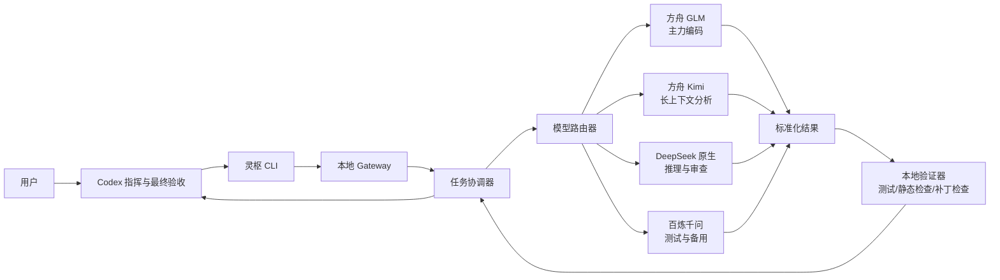

# 灵枢多模型智能体编排平台实施方案

> 文档状态：v0.3 已批准，第一版已实现并通过离线验收
> 项目名称：LingShu（灵枢）
> 目标目录：仓库根目录
> 当前范围：第一版代码、配置、测试与本地启动环境已完成；真实模型调用等待用户填入 Key 后显式启用

## 1. 项目目标

灵枢是一个本地运行的多模型智能体编排平台。它接收一个完整任务，由统一的协调器完成任务拆解、模型选择、结果收集、自动验证、返工控制和最终汇总。

第一阶段定位为“供 Codex 调用的本地轻量 Gateway”，主要服务于辅助型软件开发任务，接入以下三类模型渠道：

- 火山引擎方舟 Coding Plan Pro：第一版默认主通道，承担大部分外部模型调用；根据任务在 GLM、Kimi 和套餐内 DeepSeek 之间分工。
- DeepSeek 官方 API：默认使用 DeepSeek-V4-Flash，仅做小规模效果与费用验证，费用上限由供应商侧控制。
- 阿里云百炼千问 API：Qwen3.8-Max 作为代码模型，Qwen3.8-Flash 作为快速模型，仅做小规模对照试验，费用上限由供应商侧控制；后续再扩展多模态能力。

Codex 作为面向用户的总指挥、主要编码者和最终验收者，通过灵枢 Gateway 下达结构化任务、读取各模型结果、完成主要代码修改和本地验证，并决定接受、返工或升级给用户处理。外部模型第一版主要承担分析、评审、草拟代码、简单 Coding 和测试建议，不替代 Codex 对主仓库的控制。

## 2. 第一阶段边界

### 2.1 包含范围

- 三个供应商的 API 接入与连通性检查。
- 仅支持 OpenAI 兼容协议，包括 Chat Completions 风格请求和工具调用字段。
- 统一的请求、响应、错误和用量数据结构。
- 按任务类型进行模型路由。
- 支持规划、执行、审查、修正、验收的有限状态流程。
- 为模型提供受控的内置工具：列出文件、读取文本、搜索代码、写入任务产物和提出补丁。
- 支持简单 Coding 任务，但默认只生成建议或补丁产物，由 Codex 决定是否应用到主仓库。
- 记录模型、Token、缓存命中、延迟、重试、测试结果和估算成本。
- 第一版仅支持 Codex 监督模式；有限自动模式后续再启用。
- 提供 Windows PowerShell 下的标准启动命令。

### 2.2 暂不包含

- 第一版不开发桌面客户端或完整 Web 控制台。
- 第一版不使用鼠标、键盘模拟或桌面 Computer Use。
- 第一版不要求使用 Git worktree；是否启用 worktree 隔离留作后续增强。
- 不允许外部模型直接修改主仓库、自动发布、部署、推送远程仓库或删除重要文件。
- 不默认允许模型直接执行任意 Shell 命令。
- 不在第一版接入语音、视觉、生图和视频；只保留扩展接口。
- 不依赖重量级模型网关，先使用轻量的供应商适配层，减少依赖与密钥暴露面。

## 3. 总体架构



### 3.1 核心模块

1. **CLI 入口**
   - 接收自然语言任务、工作区路径和风险等级。
   - 提供 `doctor`、`run`、`resume`、`status`、`report`、`eval` 等命令。

2. **任务协调器**
   - 维护任务状态机。
   - 控制拆解、委派、重试、返工和停止条件。
   - 防止模型之间无限循环。

3. **模型路由器**
   - 根据任务类型、上下文长度、质量要求、当前额度和历史效果选择模型。
   - 支持固定模型、规则路由、失败回退三种模式。
   - 第一版遵循“方舟优先、原生 API 小样本验证”的路由原则。

4. **供应商适配器**
   - `ArkCodingProvider`：方舟 Coding Plan 的 OpenAI 兼容接口。
   - `DeepSeekProvider`：DeepSeek 原生 OpenAI 兼容接口。
   - `BailianProvider`：百炼业务空间的 OpenAI 兼容接口。
   - 隔离各家的鉴权、参数差异、错误码、重试策略和 Token 统计。

5. **本地 Gateway 与工具层**
   - Gateway 是 Python 进程内的统一模型入口，不是第一版必须常驻的独立网络服务。
   - 为模型暴露 `list_files`、`read_file`、`search_text`、`write_artifact`、`propose_patch` 等受控工具。
   - 第一版工具只能读取白名单工作区并向任务产物目录写入内容，不能直接修改主仓库。
   - 工具调用由灵枢执行并返回结果；模型本身不获得本机 Shell 权限。

6. **验证器**
   - 验证结构化响应格式。
   - 检查补丁能否应用。
   - 执行项目测试、类型检查、Lint 和安全规则。
   - 将失败信息转为精简的返工上下文，避免重复发送完整日志。

7. **记录与评估层**
   - 使用 SQLite 保存任务、调用、用量、结果与评分。
   - 使用 JSONL 保存可移植的调用审计记录。
   - 输出结构化数据，由 Codex 汇总为 Markdown 用量与质量报告。

## 4. 推荐技术栈

- 运行环境：Python 3.12，最低支持 Python 3.11。
- CLI：Typer。
- 数据模型：Pydantic。
- HTTP：HTTPX，供应商支持时使用 OpenAI Python SDK 的自定义 `base_url`。
- 配置：YAML + `.env`。
- 状态存储：SQLite。
- 测试：Pytest。
- 代码质量：Ruff、Pyright。
- 日志：标准 `logging` 输出人类可读日志，另写入结构化 JSONL。

第一阶段不引入消息队列和容器编排。单机异步任务使用 Python `asyncio` 控制并发，降低部署复杂度。

## 5. 目录规划

```text
LingShu/
├─ docs/
│  ├─ implementation-plan.md
│  ├─ provider-setup.md
│  └─ operations.md
├─ config/
│  ├─ models.example.yaml
│  ├─ routing.example.yaml
│  └─ policies.example.yaml
├─ src/lingshu/
│  ├─ cli.py
│  ├─ gateway/
│  ├─ orchestrator/
│  ├─ providers/
│  │  ├─ ark_coding.py
│  │  ├─ deepseek.py
│  │  └─ bailian.py
│  ├─ agents/
│  ├─ routing/
│  ├─ tools/
│  ├─ validation/
│  ├─ storage/
│  └─ observability/
├─ tests/
│  ├─ unit/
│  ├─ integration/
│  └─ evals/
├─ data/
│  └─ .gitkeep
├─ .env.example
├─ .gitignore
├─ pyproject.toml
└─ README.md
```

真实 `.env`、数据库、任务日志和模型原始响应不得提交到 Git。

## 6. 模型角色与初始路由

### 6.1 方舟 Coding Plan 模型

| 模型 ID | 第一版角色 | 使用条件 |
|---|---|---|
| `glm-5.3` | 默认主力 Coding Agent | 常规功能设计、跨文件修改方案、调试、重构和代码审查 |
| `glm-5.3-flash` | 快速 Coding 与工具调用 | 文件定位、错误归因、小改动、测试草拟、格式转换等高频低风险任务 |
| `kimi-k2.7-code` | 专用代码任务 | 代码生成、代码补全、局部重构、明确规格下的实现草案 |
| `kimi-k3` | 大仓库与长程工程分析 | 超长上下文、复杂架构、跨模块依赖、长文档与长程规划 |
| `deepseek-v4-flash` | 方舟内快速推理与复核 | 算法分析、第二意见、GLM/Kimi 结果复核和故障回退 |
| `deepseek-v4-pro` | 困难任务升级模型 | 复杂算法、疑难 Bug、高风险审查；普通任务不默认使用 |

### 6.2 原生与百炼模型

| 逻辑角色 | Provider / 模型 ID | 适用任务 | 回退渠道 |
|---|---|---|---|
| `native_reasoner_trial` | DeepSeek 官方 / `deepseek-v4-flash` | 少量推理、Coding 和独立审查对照 | 方舟 `deepseek-v4-flash` |
| `qwen_coder_trial` | 百炼 / `qwen3.8-max` | 少量代码草拟、测试设计和第二意见 | 方舟 `glm-5.3` |
| `qwen_fast_trial` | 百炼 / `qwen3.8-flash` | 少量摘要、分类、格式转换和简单问答 | 方舟 `glm-5.3-flash` |

模型 ID 不写死在协调器业务代码中，统一在 `config/models.yaml` 中配置。上表是第一版默认值。方舟测试期不启用 Auto 路由，以便把效果和额度消耗归因到具体模型。

### 6.3 第一版选择规则

1. 默认先在方舟模型中选择，不因 DeepSeek 或千问 Key 已配置就自动分流。
2. 短小、重复、低风险任务优先 `glm-5.3-flash`。
3. 常规 Coding、调试与重构优先 `glm-5.3`。
4. 明确的代码生成和局部实现可选 `kimi-k2.7-code`。
5. 大仓库、跨模块和超长上下文任务使用 `kimi-k3`。
6. 算法复核或需要不同模型提供第二意见时使用方舟 `deepseek-v4-flash`。
7. 普通模型连续失败或任务风险较高时才升级 `deepseek-v4-pro`。
8. DeepSeek 官方和百炼千问只由显式的 `trial`/`compare` 策略触发，本地记录费用但不按累计金额拦截。

## 7. API 接入设计

### 7.1 环境变量

计划提供以下 `.env.example`，其中只包含变量名和示例，不包含真实密钥：

```dotenv
ARK_CODING_API_KEY=
ARK_CODING_BASE_URL=https://ark.cn-beijing.volces.com/api/coding/v3

DEEPSEEK_API_KEY=
DEEPSEEK_BASE_URL=https://api.deepseek.com

BAILIAN_API_KEY=
BAILIAN_BASE_URL=https://dashscope.aliyuncs.com/compatible-mode/v1

LINGSHU_ENABLE_LIVE_TESTS=false
```

审批后由 Codex 创建两个文件：

- `.env.example`：提交到 Git，只包含变量名和公共地址，Key 保持空值。
- `.env`：从 `.env.example` 复制后创建，由 `.gitignore` 排除，用户可在开发过程中逐步填入真实 Key。

密钥不通过聊天、Git、日志或任务文件传递，日志默认完全隐藏密钥。没有填入 Key 时，对应 Provider 的真实连通测试显示为“跳过”，不会阻塞项目骨架、模拟测试或其他 Provider 的开发。只有用户显式设置 `LINGSHU_ENABLE_LIVE_TESTS=true` 时，测试套件才允许产生真实 API 调用和费用。

### 7.2 两个已确认请求地址的对比

| 项目 | 阿里云百炼 | 方舟 Coding Plan |
|---|---|---|
| Base URL | `https://dashscope.aliyuncs.com/compatible-mode/v1` | `https://ark.cn-beijing.volces.com/api/coding/v3` |
| 地址性质 | 华北2（北京）业务空间专属入口 | Coding Plan 专属入口 |
| 协议 | OpenAI 兼容 | OpenAI 兼容 |
| Key | 百炼业务空间 API Key | 方舟 Coding Plan API Key |
| 第一版模型 | `qwen3.8-max`、`qwen3.8-flash` | 用户提供的六个套餐模型 |
| 用量口径 | 百炼按量账单和 Token | Coding Plan 套餐额度 |
| Provider 隔离 | `bailian` | `ark_coding` |

两者可以复用统一的 OpenAI 请求客户端和标准化数据结构，但必须隔离鉴权、模型白名单、重试、用量统计和错误映射。不得因为协议相同而共用一个 API Key 或把其中一个地址作为另一个地址的自动替代。

### 7.3 方舟 Coding Plan

- 使用 Coding Plan 专属地址，不能误用普通方舟按量接口。
- OpenAI 兼容地址计划配置为 `https://ark.cn-beijing.volces.com/api/coding/v3`。
- 初期使用已确认的六个模型 ID：`kimi-k2.7-code`、`kimi-k3`、`glm-5.3`、`deepseek-v4-flash`、`glm-5.3-flash`、`deepseek-v4-pro`。
- `ark-code-latest` 仅在启用方舟 Auto 模式时使用。
- 方舟模型名称和套餐可用范围以购买后控制台为准，`doctor` 命令负责验证实际可调用模型。

### 7.4 DeepSeek 原生 API

- 使用 DeepSeek 官方 OpenAI 兼容地址 `https://api.deepseek.com`，默认模型确认采用 `deepseek-v4-flash`。
- 优先利用服务端上下文缓存：稳定的系统指令与仓库摘要置于提示词前部，变化内容置于后部。
- 首轮仅进行简易对照测试，费用上限由 DeepSeek 控制台负责。
- 独立配置单次输出上限和每任务调用上限；本地估算累计费用达到上限后立即熔断。
- 即使后续将主要 DeepSeek 流量迁入方舟，也保留原生 Provider 作为效果基准和故障回退。

### 7.5 阿里云百炼千问 API

- 使用用户提供的华北2（北京）业务空间专属 Base URL 与独立 API Key。
- API Key 可限制允许调用的模型范围。
- 第一阶段代码模型固定为 `qwen3.8-max`，快速模型固定为 `qwen3.8-flash`。
- 首轮仅进行简易对照测试，费用上限由百炼控制台负责。
- 未来的语音、视觉、生图模型继续复用百炼 Provider，但使用独立能力接口和供应商侧限额。

### 7.6 模型配置示例

```yaml
providers:
  ark_coding:
    base_url_env: ARK_CODING_BASE_URL
    api_key_env: ARK_CODING_API_KEY
    models:
      glm_primary: glm-5.3
      glm_fast: glm-5.3-flash
      kimi_code: kimi-k2.7-code
      kimi_context: kimi-k3
      deepseek_flash: deepseek-v4-flash
      deepseek_pro: deepseek-v4-pro

  deepseek:
    base_url_env: DEEPSEEK_BASE_URL
    api_key_env: DEEPSEEK_API_KEY
    models:
      default: deepseek-v4-flash

  bailian:
    base_url_env: BAILIAN_BASE_URL
    api_key_env: BAILIAN_API_KEY
    models:
      coder: qwen3.8-max
      fast: qwen3.8-flash
```

### 7.7 标准化调用结构

所有 Provider 接收统一请求：

```yaml
task_id: task-20260913-001
role: reviewer
messages: []
model_alias: deepseek-reviewer
temperature: 0.1
max_output_tokens: 8000
timeout_seconds: 180
limits:
  max_calls: 2
```

所有 Provider 返回统一响应：

```yaml
provider: deepseek
model: actual-model-id
request_id: provider-request-id
content: model-output
tool_calls: []
usage:
  input_tokens: 0
  cached_input_tokens: 0
  output_tokens: 0
latency_ms: 0
estimated_cost_cny: 0
finish_reason: stop
```

不依赖模型返回隐藏思维链。需要解释时，要求模型输出简洁的决策依据或审查报告。

## 8. 任务执行流程

### 8.1 默认状态机

```text
RECEIVED
  → CLASSIFIED
  → PLANNED
  → DISPATCHED
  → COLLECTED
  → VALIDATING
  → ACCEPTED
       或 REVISION_REQUIRED → DISPATCHED
       或 NEEDS_USER_INPUT
       或 FAILED
```

### 8.2 标准 Coding 任务

1. Codex 将用户目标转换为任务清单与验收条件。
2. Codex 或 Gateway 向模型提供必要文件；不把整个仓库无差别发送给模型。
3. 路由器优先在方舟中选择 GLM、Kimi 或 DeepSeek，通过内置工具读取有限上下文，输出分析、代码草稿或补丁建议。
4. 需要审查时优先使用方舟中的不同模型交叉复核，重点检查逻辑、边界条件和潜在回归。
5. Codex 决定是否应用补丁，并负责主要代码修改。
6. Codex 或本地验证器运行测试、类型检查和 Lint。
7. 若失败，将精简错误上下文返回原执行者，最多自动返工两轮。
8. Codex 检查差异和验证证据，生成最终交付说明。

默认不要求所有模型参与每个任务。简单任务只调用一个方舟模型；高风险任务才增加第二个方舟模型交叉审查。DeepSeek 官方与千问只参加少量显式对照任务，不进入默认 Coding 路径。第一版 Gateway 不自行接管主要 Coding 工作流。

## 9. Codex 如何调用灵枢

### 9.1 监督模式，第一阶段默认

用户在 Codex 中提出任务后，Codex 运行本地 CLI：

```powershell
.\.venv\Scripts\python.exe -m lingshu.cli run `
  --workspace "D:\Code\目标仓库" `
  --task "实现指定功能并运行测试" `
  --profile supervised
```

灵枢返回任务 ID 和结构化结果路径。Codex 读取分析、草稿或补丁建议，完成必要整合并决定是否返工。该方式全程使用命令行和文件，不占用鼠标键盘。

### 9.2 直接 CLI 模式

用户也可以直接执行：

```powershell
.\.venv\Scripts\python.exe -m lingshu.cli run --interactive
```

### 9.3 Gateway 服务模式，后续阶段

后续可以增加仅监听本机的 HTTP 服务：

```powershell
.\.venv\Scripts\python.exe -m lingshu.server --host 127.0.0.1 --port 8765
```

服务模式供 Codex、Web 控制台、自动化任务和其他本地工具调用。第一阶段 Gateway 以进程内模块和 CLI 方式运行，不开放公网访问，也不要求常驻。

## 10. 项目安装与启动方式

以下命令已在当前电脑完成离线验证：

```powershell
Set-Location "D:\Code\LingShu"
py -3.12 -m venv .venv
.\.venv\Scripts\python.exe -m pip install -e ".[dev]"
Copy-Item .env.example .env
```

用户在本机编辑 `.env` 后执行：

```powershell
.\.venv\Scripts\python.exe -m lingshu.cli doctor
.\.venv\Scripts\python.exe -m lingshu.cli eval --suite smoke
.\.venv\Scripts\python.exe -m lingshu.cli run --interactive
```

开发验证：

```powershell
.\.venv\Scripts\python.exe -m pytest
.\.venv\Scripts\python.exe -m ruff check .
.\.venv\Scripts\python.exe -m pyright
```

`doctor` 必须只显示密钥是否存在、接口连通性、实际模型名称、响应延迟和用量字段，不打印真实密钥。

开发期间允许三个 Key 分批填写：缺少某个 Key 时 `doctor` 跳过该 Provider，其他模块和测试继续运行。用户填写或修改 `.env` 后无需重新安装项目，只需重新执行 `doctor` 或目标测试。

## 11. 安全与权限控制

### 11.1 工作区隔离

- CLI 必须显式接收目标仓库路径。
- 只允许访问配置白名单中的工作区。
- 解析路径后检查其是否仍位于允许目录内，防止路径穿越。
- 第一版不强制 Git worktree；外部模型默认无主仓库写权限，因此先通过“产物目录 + Codex 审核应用”实现隔离。
- 后续允许 Gateway 直接修改代码时，再启用 Git worktree 或临时分支。

### 11.2 命令白名单

第一阶段 Gateway 内置工具优先限制为：

- 列出文件。
- 读取指定文本文件。
- 搜索代码文本。
- 写入任务产物目录。
- 生成统一 diff 格式的补丁建议。

测试、Lint 和构建命令原则上由 Codex 执行。模型不能直接拼接并执行任意命令。安装依赖、删除文件、额外网络访问、发布、推送和部署需要人工确认。

### 11.3 用量与停止条件

- 每个任务设置最大模型调用次数。
- DeepSeek 官方与百炼的金额上限由供应商控制台统一设置和执行。
- LingShu 本地继续记录 Token、调用次数和估算费用，但不因累计金额拒绝请求。
- 供应商控制台的余额、告警和限额是最终费用防线。
- 自动返工默认不超过两轮。
- 连续出现相同错误时停止循环并请求人工介入。
- 第一版不自动重试，以避免请求是否已被供应商执行不明确时产生重复费用；后续只对可确认未送达的限流或连接失败评估有界退避。

## 12. 数据记录与成本评估

第一版每次调用记录：

- 任务 ID、Provider 与实际模型。
- 输入、缓存输入、输出 Token。
- 请求时间、总延迟、成功状态和失败原因。
- API 估算费用。

Gateway 使用本地 SQLite 保存任务和调用；只有显式启用可选本地限额时才记录预算事件。系统可生成 Markdown 用量报告，但第一版不单独开发报表 UI；方舟 Coding Plan 的控制台周期使用率仍需从供应商控制台核对。

质量指标不只看模型输出主观感受，至少包括：

- 一次通过率。
- 自动测试通过率。
- 返工轮数。
- 人工修改量。
- 每个成功任务的平均成本。
- 每个成功任务的平均完成时间。

## 13. 方舟与 DeepSeek 的迁移决策

首轮先用 DeepSeek 官方和百炼完成少量对照，绝大多数真实任务继续走方舟。初始观察周期建议为两到四周，至少覆盖 20 至 30 个真实任务。以下阈值是后续策略，可根据实际套餐规则调整：

| 观测结果 | 建议动作 |
|---|---|
| 方舟周期使用率低于约 35%，DeepSeek 按量费用明显 | 将更多 DeepSeek 类任务迁入方舟，优先消耗固定额度 |
| 方舟周期使用率低于约 35%，DeepSeek 费用也很低 | 下个续费周期考虑 Pro 降级 Lite |
| 方舟使用率约 35%～80%，质量稳定 | 保持当前路由 |
| 方舟经常超过约 80% 或接近限额 | 保留 DeepSeek 原生作为溢出通道 |
| DeepSeek 原生质量显著优于方舟同名模型 | 保留原生路由，不只按额度做决定 |

切换只修改 `routing.yaml`，不修改协调器业务代码。

## 14. 分阶段实施计划

### 阶段 0：用户审阅与仓库初始化

- 用户审阅并批准本方案。
- 批准后由 Codex 在仓库根目录初始化 Git 仓库并创建项目骨架。
- Codex 创建可提交的 `.env.example`、被 Git 忽略的 `.env` 和密钥加载逻辑。
- 用户可以在 Codex 开发期间逐步向本机 `.env` 填入三方 API Key；未填写的 Provider 使用模拟测试并跳过真实调用。
- 首轮测试直接使用 Python 工程自身的单元测试和临时示例工作区，不要求用户另外准备仓库。
- 在 DeepSeek 官方和百炼控制台配置供应商侧预算或余额告警。

**完成标准：** 项目骨架和密钥文件结构就绪，真实密钥未进入 Git；Key 是否全部填写不阻塞后续开发。

### 阶段 1：项目骨架与 Provider 连通

- 创建 Python 工程、配置模型和日志基础设施。
- 实现三个 Provider 适配器。
- 实现 `doctor` 与脱敏错误处理。
- 为 HTTP 请求、错误映射和配置加载编写单元测试。

**完成标准：** 已填写 Key 的渠道可分别完成一次最小请求并返回标准化用量和延迟信息；未填写 Key 的渠道被安全跳过。

### 阶段 2：监督式 Gateway MVP

- 实现任务状态机和初始规则路由。
- 支持分析、代码草拟、审查和结果收集流程。
- 实现只读工作区工具、产物写入工具和补丁建议工具。
- 支持任务目录、断点恢复和结果汇总。
- 实现调用次数、超时和金额限制。

**完成标准：** Codex 可以将一个简单任务委派给灵枢，取得可审阅的分析、代码草稿或补丁建议，且不会无限循环。

### 阶段 3：Codex 集成与自动验收

- 实现工作区白名单和安全路径检查。
- 支持生成和检查补丁，是否应用由 Codex 决定。
- Codex 执行项目级测试、Lint 和类型检查命令。
- 高风险操作增加人工审批点。

**完成标准：** Codex 能够整合模型输出为 Markdown，并附带代码差异、模型审查和可复现的测试证据。

### 阶段 4：评估与路由优化

- 建立 20～30 个真实任务的评估集。
- 输出每周成本、质量、延迟和方舟额度利用率报告。
- 根据数据决定是否把 DeepSeek 主流量迁入方舟或将 Pro 降为 Lite。

**完成标准：** 模型路由决策可以由数据解释，而不是依赖主观印象。

### 阶段 5：多模态与服务化

- 接入百炼视觉理解、ASR、TTS 和生图模型。
- 增加本地 HTTP 服务和可选 Web 控制台。
- 根据需要增加队列、计划任务和远程执行节点。

**完成标准：** 多模态任务沿用相同的权限、供应商侧限额、记录和验收体系。

## 15. 第一轮需要用户准备的内容

请只在本机环境中准备，不要把真实 Key 发到聊天或提交到 Git：

1. 方舟 Coding Plan Pro 的专属 API Key。
2. DeepSeek 官方 API Key，并确保小额余额足以完成测试。
3. 百炼华北2（北京）业务空间 API Key。

Codex 已创建 `.env.example` 和被 Git 忽略的 `.env`，用户可在本机 `.env` 中逐项填写。方舟模型 ID、三个 Base URL 和千问模型选择已经确认，不再要求用户重复提供。

## 16. 已确认决策与剩余确认项

### 16.1 已确认

- 项目主体使用 Python，由 Codex 负责初始化 Git 仓库和选择具体工具链。
- 第一版不强制在 Git worktree 中执行。
- 外部模型只承担辅助分析、简单 Coding、代码草拟和审查，主要 Coding 仍由 Codex 完成。
- 大部分外部模型任务交给方舟 Coding Plan；DeepSeek 官方和百炼只做小规模对照试验。
- DeepSeek 使用官方地址 `https://api.deepseek.com`，默认模型为 `deepseek-v4-flash`。
- DeepSeek 官方与百炼使用供应商侧预算限制，LingShu 本地不设置累计金额上限。
- 方舟可使用 `kimi-k2.7-code`、`kimi-k3`、`glm-5.3`、`deepseek-v4-flash`、`glm-5.3-flash`、`deepseek-v4-pro`。
- 千问代码模型为 `qwen3.8-max`，快速模型为 `qwen3.8-flash`。
- 第一版只支持 OpenAI 兼容协议。
- 调用记录由 Gateway 输出结构化数据，Markdown 报告由 Codex 整合。
- 审批后由 Codex 创建 `.env.example` 和被 Git 忽略的 `.env`；用户可在开发过程中分批填写 Key，缺失 Key 不阻塞非真实调用测试。

### 16.2 下一步

- 用户在本机 `.env` 中填入三个 API Key。
- 用户显式启用真实测试后，依次执行每个 Provider 的最小连通测试。
- 根据首轮真实调用结果校准模型 ID、价格配置与任务路由。

## 17. 官方参考

- [方舟 Coding Plan](https://www.volcengine.com/activity/codingplan)
- [DeepSeek API 定价与模型](https://api-docs.deepseek.com/quick_start/pricing/)
- [DeepSeek Codex 集成与模型定位](https://api-docs.deepseek.com/quick_start/agent_integrations/codex/)
- [GLM-5.3 Coding Agent 官方说明](https://zcode.z.ai/en/docs/welcome)
- [GLM-5.3-Flash 官方说明](https://autoclaw.z.ai/blog/model/glm-5.3-flash/)
- [Kimi K3 官方技术博客](https://www.kimi.com/en/blog/kimi-k3)
- [Kimi Code 模型说明](https://www.kimi.com/code/docs/en/kimi-code/models.html)
- [百炼首次调用千问 API](https://help.aliyun.com/zh/model-studio/first-api-call-to-qwen)
- [百炼华北2（北京）地域接入信息](https://help.aliyun.com/zh/model-studio/beijing-access-information)
- [百炼获取与配置 API Key](https://help.aliyun.com/zh/model-studio/get-api-key)
